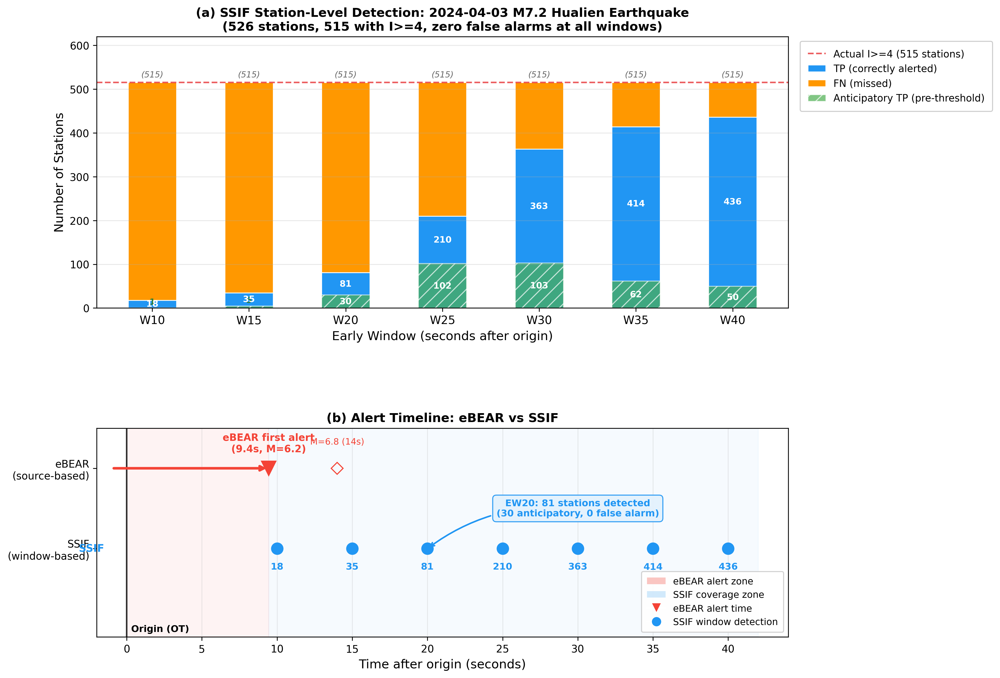

# Case Study: 2024 April 3 M7.2 Hualien Earthquake — SSIF vs eBEAR

## Event Overview

On April 3, 2024 at 07:58:09 Taipei time (UTC 23:58:09 on April 2), a magnitude 7.2 earthquake struck near the eastern coast of Taiwan, centered at 121.584°E, 23.861°N with a focal depth of 22.5 km. This was the largest earthquake to hit Taiwan since the 1999 Chi-Chi event, producing widespread strong shaking across the island and causing significant structural damage and casualties in Hualien County. The event is included in the 147-event testing split and was never seen during SSIF training, making it an ideal case study for evaluating the model's ability to generalize to a major damaging earthquake.

The CWA network recorded 526 station–event records for this earthquake, of which 515 stations (97.8%) experienced a final peak intensity of CWA class ≥4—the alert threshold used throughout this study. The intense shaking extended far beyond the epicentral region: stations in northern Taiwan (Taipei, New Taipei) recorded class 5− to 6−, and stations as far south as Tainan and Kaohsiung reached class 4. This broad intensity footprint reflects the large magnitude and the island-wide propagation of seismic waves through the Taiwan orogen, providing a demanding test of SSIF's station-level prediction capability across a wide range of epicentral distances (8–230 km).

## SSIF Station-Level Detection Performance

SSIF was evaluated across all seven prediction windows (10–40 s) for this event. Zero false alarms were produced at every window—every station that SSIF predicted to alert (I ≥ 4) was a true positive, yielding precision of 1.000 throughout. The probability of detection (POD) improved monotonically with window length: SSIF correctly identified 18 stations at 10 s (3.5% of 515), 81 stations at 20 s (15.7%), and 436 stations at 40 s (84.7%). The alert probability threshold, calibrated on a separate data split, varied from 0.979 (10 s) to 0.713 (40 s), reflecting the calibration procedure's adaptation to each window's signal-to-noise level.

| Window (s) | Stations Detected | Actual I ≥ 4 | TP | FP | FN | POD | Anticipatory TP |
|-----------|-------------------|--------------|----|----|-----|------|-----------------|
| 10 | 18 | 515 | 18 | 0 | 497 | 0.035 | 1 |
| 15 | 35 | 515 | 35 | 0 | 480 | 0.068 | 5 |
| 20 | 81 | 515 | 81 | 0 | 434 | 0.157 | 30 |
| 25 | 210 | 515 | 210 | 0 | 305 | 0.408 | 102 |
| 30 | 363 | 515 | 363 | 0 | 152 | 0.705 | 103 |
| 35 | 414 | 515 | 414 | 0 | 101 | 0.804 | 62 |
| 40 | 436 | 515 | 436 | 0 | 79 | 0.847 | 50 |

The anticipatory true positives—stations whose final intensity reached ≥4 but had not yet locally observed ≥4 at the prediction time and were correctly alerted by SSIF—rose from 1 at 10 s to 103 at 30 s. At the 20-second window, 30 of 81 detections were anticipatory, meaning the model predicted strong shaking before the threshold was locally crossed at these stations. These anticipatory detections represent genuine advance warning that a persistence-based system cannot provide by construction, and they correspond to stations at intermediate epicentral distances (60–100 km) where the S-wave had not yet arrived but the evolving P-wave-dominated intensity trajectory already contained sufficient signal for the model to forecast the incoming strong shaking.

## Comparison with eBEAR

The operational eBEAR system issued its first alert 9.4 seconds after origin time (ST − OT = 9.44 s), with an initial online magnitude estimate of 6.2. A subsequent update at 14.0 seconds revised the magnitude to 6.8. eBEAR's alert was classified as region-positive under the 47-reference-point criterion, consistent with the widespread ≥4 shaking observed across Taiwan. Both systems successfully detected this event—the eBEAR system through its rapid source-parameter estimation and SSIF through its observation-based intensity trajectory analysis.

Despite both systems detecting the event, their operational roles differ fundamentally. eBEAR provided the earliest alert (~9 s), but its point-source pathway issued high-level Public Warning System alerts to only 12 counties and cities, notably omitting several densely populated northern areas including Taipei, where CWA intensity reached class 5− to 6− (Song et al., 2025). SSIF, while requiring the full observation window to issue station-level alerts, produced zero false alarms at every window and correctly identified stations across the full geographic extent of the shaking, including the northern regions that eBEAR's alert regions omitted. At the 20-second window, SSIF had already detected 81 stations across Hualien, Nantou, Taichung, Chiayi, and Taitung—regions where strong shaking was imminent or already arriving—providing spatially granular, station-level alerts that complement eBEAR's broader but less geographically precise regional warnings.

The complementarity is clear: eBEAR's source-based approach delivers the earliest system-level alert (~9 s), while SSIF's observation-based approach delivers station-by-station confirmation and supplementary detection that progressively covers the full shaking footprint as the window extends from 20 to 40 seconds. For a mega-event like the 2024 Hualien earthquake, integrating both pathways would provide both rapid initial notification (eBEAR at ~9 s) and comprehensive spatial verification (SSIF from 20 s onward), addressing the documented limitation of point-source EEW during complex or finite-fault ruptures.

*Figure. SSIF vs eBEAR performance for the 2024 April 3 M7.2 Hualien earthquake. (a) Station-level detection counts across prediction windows: blue = true positives, green (hatched) = anticipatory true positives (detected before local threshold crossing), orange = missed stations. The dashed red line marks the 515 stations with actual I ≥ 4. (b) Alert timeline: eBEAR issued its first alert at 9.4 s (red triangle); SSIF detection windows are shown as blue circles with the number of alerted stations at each window.*